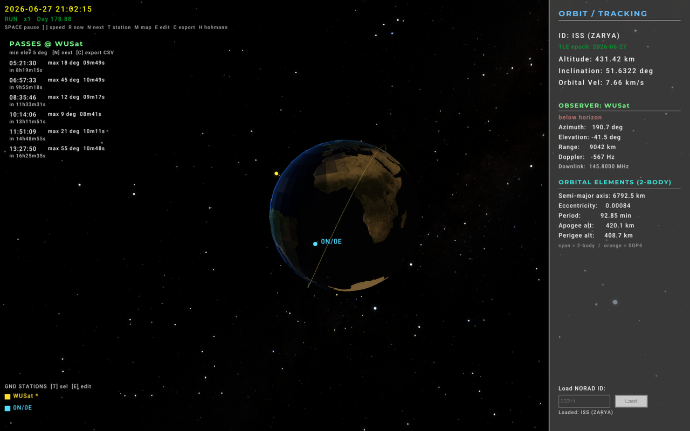

# Satellite-Simulator

A real-time 3D satellite simulator and **pass-prediction** tool for radio/comms
CubeSat operations. It fetches live orbital data (TLE) for any catalogued
satellite, propagates it with SGP4, renders a lit 3D Earth with the ground track,
and computes everything a ground station needs to plan and work a contact:
acquisition/loss times, antenna pointing (azimuth/elevation), slant range, and
the Doppler shift on the radio link.

 <!-- add a screenshot here -->

## Features

- **Pass prediction** — upcoming passes over the selected ground station for the
  next 24 h: AOS/LOS times, peak elevation, duration, and rise/set azimuths,
  filtered by a per-station elevation mask.
- **Live observer geometry** — real-time azimuth, elevation, slant range, and
  above/below-horizon status from the selected station to the satellite.
- **Doppler shift** — instantaneous frequency offset on a configurable downlink,
  derived from the line-of-sight range-rate.
- **Controllable simulation clock** — pause, speed up/slow down, reset to now, and
  jump straight to the next pass. The whole scene (Earth rotation, Sun/terminator,
  satellite, ground track) follows the simulated instant.
- **Any satellite** — load any NORAD catalog ID at runtime from CelesTrak (fetched
  on a background thread so the UI never freezes), with an on-disk TLE cache so the
  app still works offline (cached TLEs are flagged in the UI, and the TLE epoch is
  shown so you can judge freshness).
- **Editable ground stations & link** — add/edit/delete stations (name, lat, lon,
  altitude, elevation mask) and set the downlink frequency from an in-app editor.
- **2D ground-track map** — a toggleable equirectangular world map showing the
  sub-point, predicted ground track, and station locations.
- **CSV export** — write the predicted pass schedule to `exports/` for sharing or
  importing into a scheduling spreadsheet.
- **SGP4 vs. two-body comparison** — the perturbed SGP4 ground track (orange) is
  plotted against an independent from-scratch Keplerian propagator (cyan).

## Controls

| Input | Action |
|-------|--------|
| Right-mouse + move | Look around |
| `W`/`A`/`S`/`D` or arrows | Move camera |
| Mouse wheel | Zoom |
| `SPACE` | Pause / resume the simulation clock |
| `[` / `]` | Slow down / speed up time |
| `R` | Reset clock to real "now" (1×) |
| `N` | Jump to the next pass (10 s before AOS) |
| `T` | Select the next ground station as the observer |
| `M` | Toggle the 2D ground-track map |
| `E` | Toggle the station / downlink editor |
| `C` | Export the current pass schedule to CSV |
| `F` | Toggle fullscreen |
| Sidebar text box | Enter a NORAD ID and press **Load** (or Enter) |

## Building

Requirements: a C++17 compiler, **CMake ≥ 3.10**, **raylib**, and **libcurl**.
SGP4 and raygui are vendored under `third_party/`.

```sh
# macOS (Homebrew)
brew install raylib curl cmake

# Debian/Ubuntu
sudo apt install libraylib-dev libcurl4-openssl-dev cmake build-essential
```

```sh
cmake -S . -B build
cmake --build build -j
./build/sat_sim
```

Assets are copied next to the binary automatically. On first run the app fetches
the default satellite (ISS, NORAD 25544) and writes a TLE cache to `tle_cache/`.

### Tests

Headless unit tests cover the orbital math and pass prediction (no display or
network required):

```sh
cmake -S . -B build          # BUILD_TESTING is ON by default
cmake --build build -j
ctest --test-dir build --output-on-failure
```

## Project layout

| File | Responsibility |
|------|----------------|
| `main.cpp` | Window, render pipeline, UI, input, and wiring |
| `SimClock.{hpp,cpp}` | Controllable simulation clock (play/pause/speed/jump) |
| `PassPredict.{hpp,cpp}` | Look angles, AOS/LOS pass prediction, Doppler |
| `fetchTLE.{hpp,cpp}` | CelesTrak fetch, TLE parsing, offline cache, propagation helpers |
| `OrbitalMechanics.{hpp,cpp}` | From-scratch two-body (Keplerian) propagator |
| `EarthMath.{hpp,cpp}` | Earth Rotation Angle (IERS) |
| `SunMath.{hpp,cpp}` | Solar position for the day/night terminator |
| `tests/` | Headless unit tests (orbital math, pass prediction) |
| `third_party/sgp4` | libsgp4 SGP4 propagator |
| `third_party/raygui` | Immediate-mode UI |

## Notes & limitations

- Pass prediction scans a 24 h horizon from the current simulation instant and
  refines AOS/LOS to ~1 second by bisection.
- The downlink frequency used for Doppler is currently set in code
  (`downlinkHz` in `main.cpp`); ground stations are defined in the
  `groundStations[]` table. Both are good next candidates for a settings file.
- TLE/SGP4 accuracy degrades several days past the TLE epoch — refresh often;
  the epoch is shown in the sidebar (orange when served from cache).
